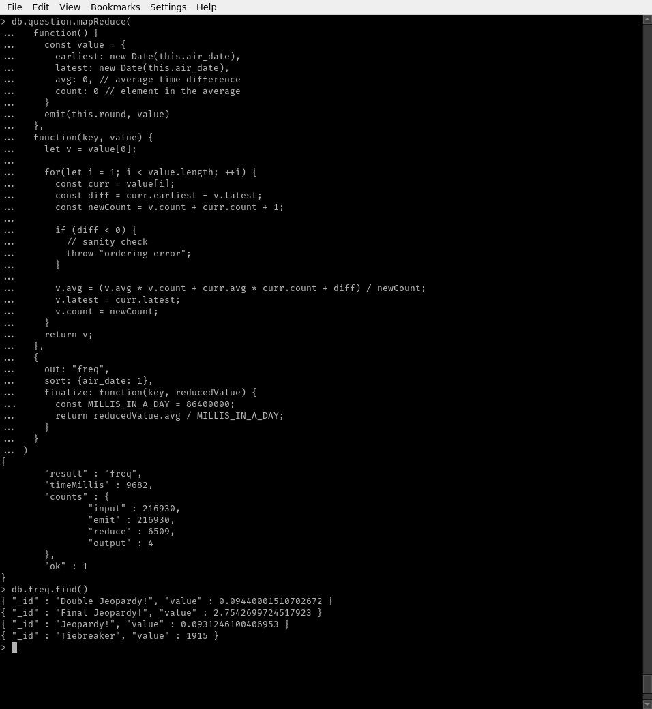

## Konfiguracja środowiska

Do uruchomienia lokalnej instancji mongodb użyłem obrazu dockera `mongo:4.0`. Całość opisuje plik `docker-compose.yaml`:

```yaml
version: "2.2"

services:
  mongo:
    image: mongo:4.0
    network_mode: host
    volumes:
      - "db-mongo:/data/db"

volumes:
  "db-mongo":
```


## Import danych

W celu użycia polecenia `mongoimport` konieczne było edycja pliku `JEOPARDY_QUESTIONS1.json` aby zawierał osobne obiekty json, nie objęte listą, to znaczy do postaci:

```json
  {
    "category": "HISTORY",
    "air_date": "2004-12-31",
    "question": "'For the last 8 years of his life, Galileo was under house arrest for espousing this man's theory'",
    "value": "$200",
    "answer": "Copernicus",
    "round": "Jeopardy!",
    "show_number": "4680"
  }
    ...
  {
    "category": "HISTORIC NAMES",
    "air_date": "2006-05-11",
    "question": "'A silent movie title includes the last name of this 18th c. statesman & favorite of Catherine the Great'",
    "value": null,
    "answer": "Grigori Alexandrovich Potemkin",
    "round": "Final Jeopardy!",
    "show_number": "4999"
  }
```

Import:

```bash
mongoimport --db jeopardy --collection question --type json --file questions.json
```

## Zapytania

### Find
Zapytanie ma na celu znalezienie wzmianek o Polsce w pytaniach bądź odpowiedziach na nie. Pytania zwracane sę w porządku chronologicznym nagrań.

```js
// Wszystkie pytania gdzie w pytaniu lub odpowiedzi znajduje się słowo "Poland"
// posortowane w kolejności odbywania się nagrań
use jeopardy
db.question.
  find({
    $or: [
      {question: {$regex: /Poland/}},
      {answer: {$regex: /Poland/}}]
  }).
  sort({show_number: 1})
```

\ 

### Agregacja
Zapytanie ma na celu określenie liczby nagrań odbywających się w danym roku i numeru pierwszego z nich. Wykorzstuje dwukrotnie parametr `$group` aby zliczać 
unikalne `show_number` zamiast wszystkich pytań.

Wyniki sortowane są według malejącej liczby nagrań, a w drugiej kolejności w odwróconym porządku chronologicznym.

```js
use jeopardy
db.question.aggregate([
        {$addFields:
          {
            year: {$year: {$toDate: "$air_date"}},
            show_number: {$toInt: "$show_number"}
          }
        },
        {$group:
          {_id: "$show_number", year: {$min: "$year"}}
        },
        {$group:
          {_id: "$year", count: {$sum: 1}, first_show: {$min: "$_id"}}
        },
        {$sort:
          {count: -1, first_show: -1}
        }
])
```

\ 

### MapReduce

Zapytanie inspirowane fragmentem opisu zbioru: "Note: Tiebreaker questions do happen but they're very rare (like once every 20 years)".
Ma na celu wyznaczenie średniej liczby dni pomiędzy pytaniami każdego rodzaju.

Ponieważ wykorzystuje parametr `sort`, konieczne było przed jego wykonaniem utworzenie indexu. W przeciwnym razie baza zgłaszała błąd przekroczenia maksymalnego zużycia pamięci:

```js
db.question.createIndex({air_date: 1})
```

Dzięki użyciu sortowania, redukowane zakresy pytań są rozłączne. Pozwala to na redukcję kilku średnich częstotliwości do jednej.

Funkcja `finalize` pozwaliła wyłuskać z roboczego formatu poszukiwaną informację - częstotliwość występowania pytań (w dniach).

```js
use jeopardy
db.question.mapReduce(
  function() {
    const value = {
      earliest: new Date(this.air_date),
      latest: new Date(this.air_date),
      avg: 0, // average time difference
      count: 0 // elements in the average
    }
    emit(this.round, value)
  },
  function(key, value) {
    let v = value[0];

    for(let i = 1; i < value.length; ++i) {
      const curr = value[i];
      const diff = curr.earliest - v.latest;
      const newCount = v.count + curr.count + 1;

      if (diff < 0) {
        // sanity check
        throw "ordering error";
      }

      v.avg = (v.avg * v.count + curr.avg * curr.count + diff) / newCount;
      v.latest = curr.latest;
      v.count = newCount;
    }
    return v;
  },
  {
    out: "freq",
    sort: {air_date: 1},
    finalize: function(key, reducedValue) {
      const MILLIS_IN_A_DAY = 86400000;
      return reducedValue.avg / MILLIS_IN_A_DAY;
    }
  }
)
```


Otrzymane wyniki wskazuję, że pytania "Tiebreaker" zdarzają się średnio co 1915 dni, czyli nieco ponad 5 lat.

\ 


## Aplikacja w pythonie

Kod aplikacji znajduje się w pliku `app.py`. W katalogu `env` znajduje się wirtualne środowisko pythona z zainstalowanym pakietem `pymongo`. Skrypt `run.sh` aktywuje to środowisko i uruchamia `app.py`.

Po uruchomieniu aplikacja w pierwszej kolejności wykonuje odpowiednik zapytania (2):

```py
def yearly_report(collection):
    """
    Return generator for yearly count of shows
    aired and their initial no.
    """
    return collection.aggregate([
        {'$addFields': {
            'year': {'$year': {'$toDate': "$air_date"}},
            'show_number': {'$toInt': "$show_number"}
        }},
        {'$group':
         {'_id': "$show_number", 'year': {'$min': "$year"}}
         },
        {'$group':
         {'_id': "$year", 'count': {'$sum': 1}, 'first_show': {'$min': "$_id"}}
         },
        {'$sort': SON([('count', -1), ('first_show', -1)])}
    ])
```

\ 


Następnie uruchamiane jest mapReduce zliczające średnie częstotliwości pytań:

```py
def frequencies(collection):
    # using "sort" parameter in mapReduce requires an index
    # as the database hits RAM usage limit otherwise
    collection.create_index([('air_date', 1)])

    mapper = Code("""
        function() {
            const value = {
            earliest: new Date(this.air_date),
            latest: new Date(this.air_date),
            avg: 0, // average time difference
            count: 0 // element in the average
            }
            emit(this.round, value)
        }
    """)

    reducer = Code("""
        function(key, value) {
            // sort dates in ascending order
            let v=value[0]

            for(let i=1; i < value.length; ++i) {
                const curr=value[i]
                const diff=curr.earliest - v.latest
                const newCount=v.count + curr.count + 1

                if (diff < 0) {
                    // sanity check
                    throw "ordering error"
                }

                v.avg=(v.avg * v.count + curr.avg * curr.count + diff) / newCount
                v.latest=curr.latest
                v.count=newCount
            }
            return v
        }
    """)

    finalizer = Code("""
        function(key, reducedValue) {
            const MILLIS_IN_A_DAY=86400000
            return reducedValue.avg / MILLIS_IN_A_DAY
        }
    """)

    resultscol = collection.map_reduce(
        mapper, reducer, "freq", sort=SON([("air_date", 1)]), finalize=finalizer)
    return resultscol
```


Na koniec wykonywany jest odpowiednik podstawowego zapytania "find". Użytkownik ma możliwość podania własnego wyrazu do wyszukania. Wciśnięcie "enter" powoduje użycie domyślnego słowa "Poland".

```py
def find_mentions(collection, word):
    """
    Find mentions of given word in the question or answer
    """

    regex = re.compile(word)
    return collection \
        .find({'$or': [{'question': regex}, {'answer': regex}]}) \
        .sort('show_number')


def format_question(question):
    """
    Pretty format a question document
    """
    return """category: {q[category]}
show no:  {q[show_number]}
date:     {q[air_date]}
round:    {q[round]}
value:    {q[value]}
question: {q[question]}
answer:   {q[answer]}
""".format(q=question)
```

