## Zadanie 3: Implementacja metod w klasie Solution

```java
public class Solution {

    private final GraphDatabase graphDatabase = GraphDatabase.createDatabase();

    public void databaseStatistics() {
        System.out.println(graphDatabase.runCypher("CALL db.labels()"));
        System.out.println(graphDatabase.runCypher("CALL db.relationshipTypes()"));
    }

    public void runAllTests() {
        System.out.println(findActorByName("Emma Watson"));
        System.out.println(findMovieByTitleLike("Star Wars"));
        System.out.println(findRatedMoviesForUser("maheshksp"));
        System.out.println(findCommonMoviesForActors("Emma Watson", "Daniel Radcliffe"));
        System.out.println(findMovieRecommendationForUser("emileifrem"));
    }

    private String findActorByName(final String actorName) {
        return graphDatabase.runCypher(
                String.format("MATCH (p:Actor {name: \"%s\"}) return p", actorName)
        );
    }

    private String findMovieByTitleLike(final String movieName) {
        String query = "MATCH (m:Movie) WHERE m.title CONTAINS \"%s\" RETURN m.title LIMIT 1";
        return graphDatabase.runCypher(String.format(query, movieName));
    }

    private String findRatedMoviesForUser(final String userLogin) {
        String query = "MATCH (u:User {login: \"%s\"}) -[:RATED]-> (m:Movie) RETURN m.title";
        return graphDatabase.runCypher(String.format(query, userLogin));
    }

    private String findCommonMoviesForActors(String actorOne, String actrorTwo) {
        String query = "MATCH (a1:Actor {name: \"%s\"}) -[:ACTS_IN]-> (m:Movie) <-[:ACTS_IN]-" +
                "(a2:Actor {name: \"%s\"}) RETURN m.title";
        return graphDatabase.runCypher(String.format(query, actorOne, actrorTwo));
    }

    /**
     * Finds movies rated highly be people who has given the same rating
     * to some movie as the given user.
     */
    private String findMovieRecommendationForUser(final String userLogin) {
        String query = "MATCH (u:User {login: \"%s\"}) " +
                "-[r1:RATED]-> (m:Movie) " +
                "<-[r2:RATED]- (other:User) " +
                "-[r3:RATED]-> (m2:Movie) " +
                "WHERE r1.stars = r2.stars AND r3.stars >= 3 RETURN m2.title";
        return graphDatabase.runCypher(String.format(query, userLogin));
    }

}
```

Wyniki:

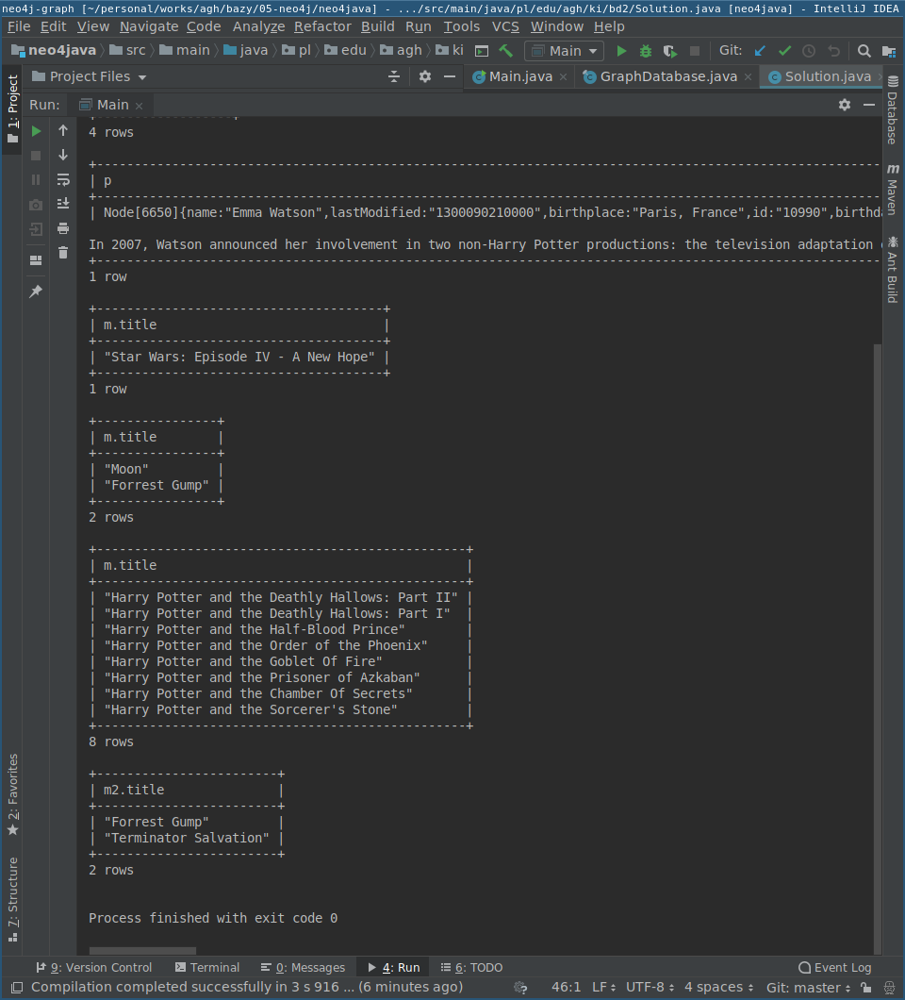\ 

## Zadanie 4: Dodanie aktora i filmu

```java
        final String newMovie = "Tales of D17";
        final String newActor = "Alan Turing";

        System.out.println(addActorWithMovie(newActor, newMovie));

// ...

    private String addActorWithMovie( final String actorName, final String title) {
        String query = "CREATE (a:Actor {name: \"%s\"}) -[:ACTS_IN]-> (m:Movie {title: \"%s\"})";
        return graphDatabase.runCypher(String.format(query, actorName, title));
    }
```

Wyniki:

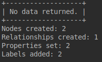\ 

## Zadanie 5: Ustawić datę i miejsce urodzenia:

```java
        final String birtplace = "London";
        final String birthday = "-1815350400";

        System.out.println(setBirth(newActor, birtplace, birthday));

// ...

    private String setBirth(final String actorName, final String place, final String date) {
        String query = "MATCH (a:Actor {name: \"%s\"}) " +
                "SET a.birthday = \"%s\", a.birthplace = \"%s\"" +
                "RETURN a";
        return graphDatabase.runCypher(String.format(query, actorName, date, place));
    }
````

Wyniki:

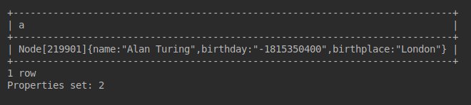\ 

## Zadanie 6: Znaleźć aktorów grających w co najmniej 6 filmach

```java
        System.out.println(findBusyActors(6));

// ...

    private String findBusyActors(final int minimumMovies) {
        String query = "MATCH (a:Actor) -[:ACTS_IN]-> (m:Movie) " +
                "WITH a, collect(m.title) as movies " +
                "WHERE length(movies) >= %d " +
                "RETURN a.name";
        return graphDatabase.runCypher(String.format(query, minimumMovies));
    }
```

Wyniki:

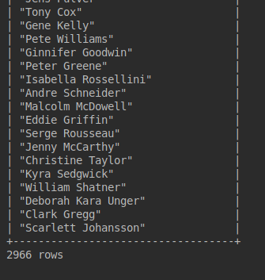\ 


## Zadanie 7: średnia wystąpień w filmach dla aktorów o co najmniej 7 filmach

```java
        System.out.println(computeAverage(7));

// ...

    private String computeAverage(final int minimumMovies) {
        String query = "MATCH (a:Actor) -[:ACTS_IN]-> (m:Movie) " +
                "WITH a, collect(m.title) as movies " +
                "WHERE length(movies) >= %d " +
                "RETURN avg(length(movies))";
        return graphDatabase.runCypher(String.format(query, minimumMovies));
    }
```

Wyniki:

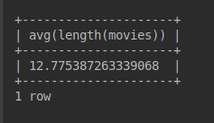\ 


## Zadanie 8: aktorzy co najmniej 5 filmóœ z doświadczeniem reżyserskim

```java
        System.out.println(actingDirectors(5));

// ...

    private String actingDirectors(final int minimumMovies) {
        String query = "MATCH (a:Actor)-[:DIRECTED]->(m:Movie), " +
                "(a:Actor) -[:ACTS_IN]-> (m2:Movie) " +
                "WITH a,  count(m2) AS acted " +
                "WHERE acted >= %d " +
                "RETURN a.name, acted " +
                "ORDER BY acted DESC ";
        return graphDatabase.runCypher(String.format(query, minimumMovies));
    }
```

Wyniki:

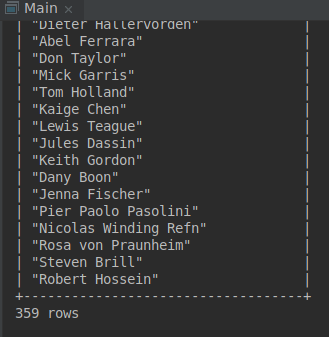\ 

## Zadanie 9: Wypisać film oceniony przez znajomego i jego ocenę

```java
        final String username = "maheshksp";
        System.out.println(friendRatings(username));

// ...

    private String friendRatings(final String user) {
        String query = "MATCH (u:User {login: \"%s\"}) " +
                "-[:FRIEND]-> (f:User) -[r:RATED]-> (m:Movie) " +
                "RETURN f.name, r.stars, m.title";
        return graphDatabase.runCypher(String.format(query, user));
    }
```

Wyniki:

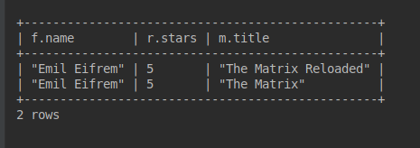\ 

## Zadanie 10: Ścieżki między aktorami

```java
        System.out.println(pathsBetweenActors("Simon Pegg", "Emma Watson"));

// ...

    private String pathsBetweenActors(final String actorOne, final String actorTwo) {
        String query = "MATCH path = (a:Actor {name: \"%s\"}) -[*1..6]- (b:Actor {name: \"%s\"}) " +
                "RETURN DISTINCT [n IN nodes(path) WHERE NOT \"Movie\" IN LABELS(n) | n.name]";
        return graphDatabase.runCypher(String.format(query, actorOne, actorTwo));
    }
```

Wyniki:

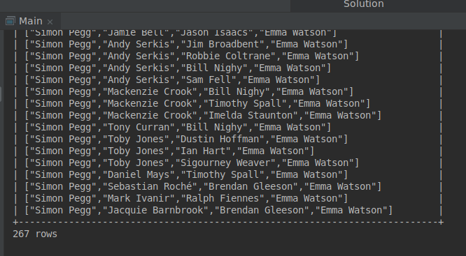\ 

## Zadanie 11: Profilowanie

Ponieważ w wynikach zapytań uzyskiwanych w Javie nie ma informacji z komendy `PROFILE`, posłużyłem się interfejsem webowym:

Wyszukanie aktora bez indeksu:

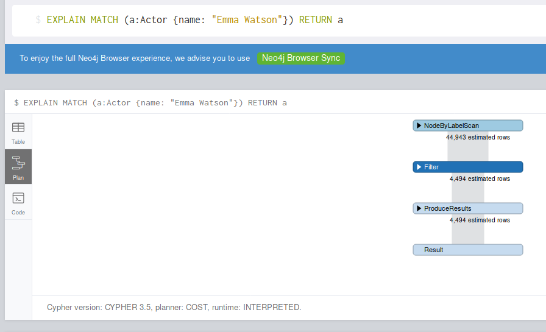\ 

Dodanie indeksu:

```cipher
CREATE INDEX ON :ACTOR(name)
```

Wyszukanie z indeksem
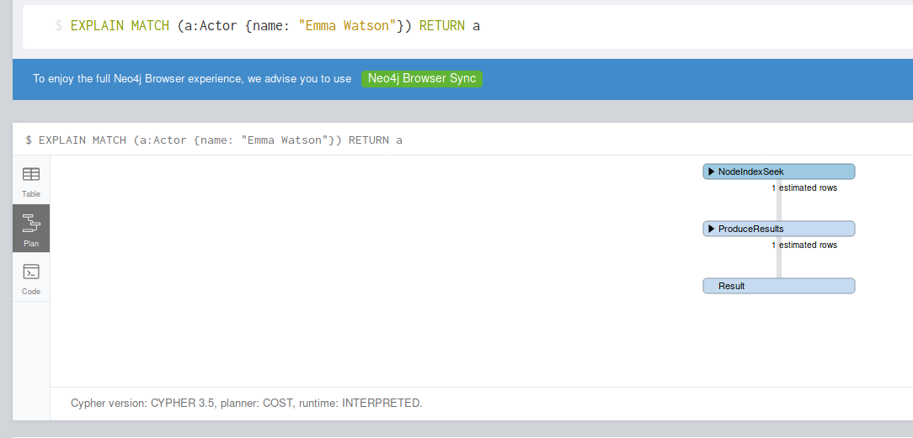\ 

Pomiar czasu wyszukiwania w Javie:

```java
    private void profileActorSearch(final String actorName) {
        long start, end;
        final String query = String.format("MATCH (p:Actor {name: \"%s\"}) return p", actorName);

        try {
            graphDatabase.runCypher("CREATE INDEX ON :Actor(name)");
        } catch (Exception ignored) { // Prevent failure if index already exists
        }

        start = System.nanoTime();
        graphDatabase.runCypher(query);
        end = System.nanoTime();
        System.out.println(String.format("With index:\t\t%7d us", (end - start) / 1000));

        graphDatabase.runCypher("DROP INDEX ON :Actor(name)");

        start = System.nanoTime();
        graphDatabase.runCypher(query);
        end = System.nanoTime();
        System.out.println(String.format("Without index:\t%7d us", (end - start) / 1000));
    }
```


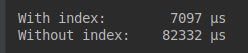\ 


Wyznaczanie najkrótszej ścieżki bez indeksu:

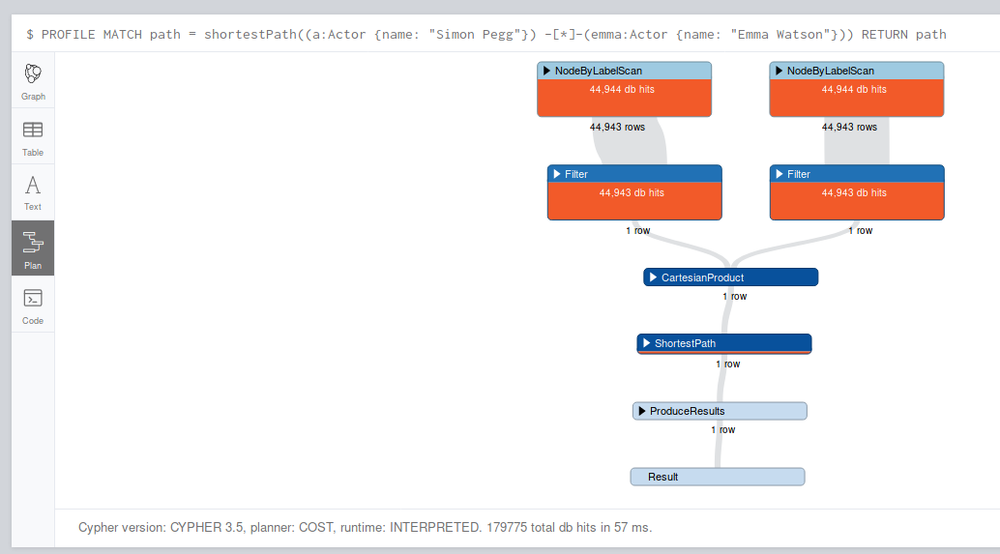\ 

Wyznaczanie najkrótszej ścieżki z indeksem:

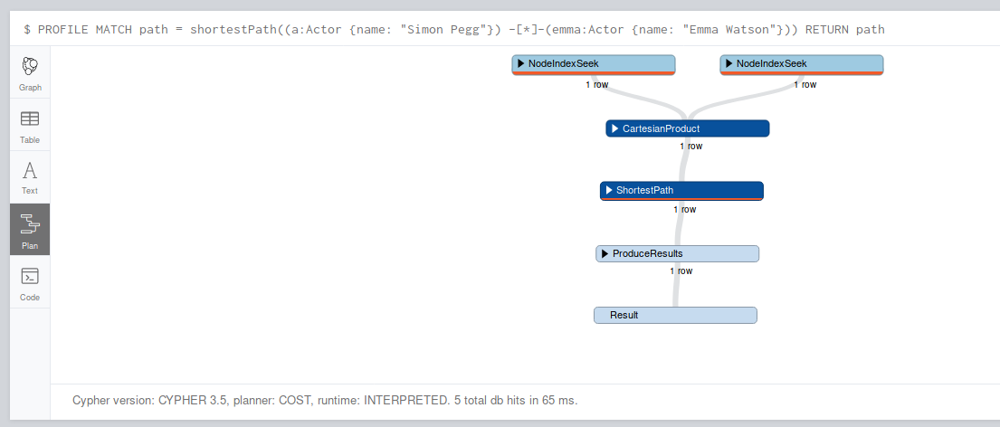\ 

Pomiary czasu szukania ścieżki w Javie:


```java
    private void profileShortestPath(final String actorOne, final String actorTwo) {
        long start, end;
        final String query = String.format(
                "MATCH path = shortestPath(" +
                        "(a:Actor {name: \"%s\"}) -[*]-(b:Actor {name: \"%s\"})) " +
                        "RETURN path",
                actorOne, actorTwo);

        try {
            graphDatabase.runCypher("CREATE INDEX ON :Actor(name)");
        } catch (Exception ignored) { // Prevent failure if index already exists
        }

        try {
            graphDatabase.runCypher("CREATE INDEX ON :Movie(title)");
        } catch (Exception ignored) { // Prevent failure if index already exists
        }

        start = System.nanoTime();
        graphDatabase.runCypher(query);
        end = System.nanoTime();
        System.out.println(String.format(
                "Shortest path with index:\t\t%7d us", (end - start) / 1000));

        graphDatabase.runCypher("DROP INDEX ON :Actor(name)");
        graphDatabase.runCypher("DROP INDEX ON :Movie(title)");

        start = System.nanoTime();
        graphDatabase.runCypher(query);
        end = System.nanoTime();
        System.out.println(String.format(
                "Shortest path without index:\t%7d us", (end - start) / 1000));
    }
```


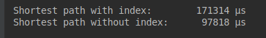\ 

Jak się okazuje, wpływ indeksu na to przeszukiwanie nie jest wystarczająco znaczący, bo wpłynąć pozytywnie na pomiar czasu.